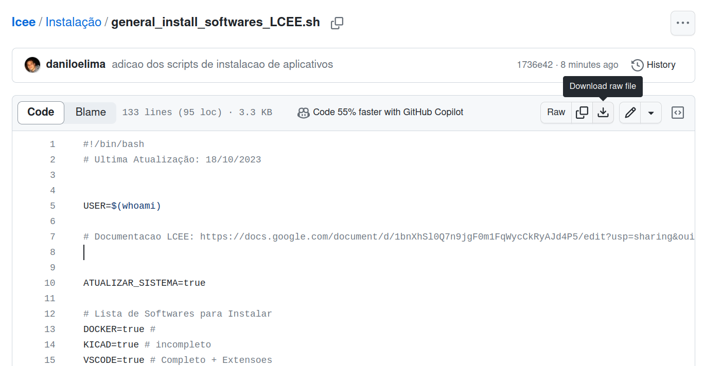

# Instalação de Softwares

Nesse subdiretório do repositório encontramos uma série de scripts shell para facilitar a instalação de programas, como docker, octave, vscode, etc...


# Como executar um Shell Script

Voce deve baixar o código do script desejado e localiza-lo em seu terminal.

Você pode baixar um único arquivo sem precisar do repositório inteiro ao abrir o [link do arquivo ](https://github.com/daniloelima/lcee/blob/main/Instala%C3%A7%C3%A3o/general_install_softwares_LCEE.sh) e clicar no botão de *Download raw file*:




Com o arquivo baixado, você deve abrir um terminal (utilize o atalho Ctrl+Alt+T) no seu computador e localizar aonde você colocou seu arquivo. Vamos supor que você salvou seu arquivo dentro da pasta de documentos, logo voce deve executar o comando:

```shell
  lcee@user:~$ cd Documentos/
```

Estando dentro da pasta, você pode verificar se esta correto utilizando o comando "ls" e buscando o arquivo do script que você deseja, caso encontre o arquivo dentro da lista podemos prosseguir.

A partir dai você tem duas opções para instalar os programas, rode o seguintes comandos no terminal:

- Opção 1 (Altere as permissões do script para torná-lo executável):
```shell
  lcee@user:~/Downloads$ chmod +x $nome_do_arquivo.sh
  lcee@user:~/Downloads$ ./$nome_do_arquivo.sh
```

- Opção 2 (Rodar utilizando o interpretador):
```shell
  lcee@user:~/Downloads$ bash $nova_do_arquivo.sh
```

Por serem scripts de instalação de programas talvez sera necessário usar o login e senha para dar permissão de super usuário, além de alguns programas exigirem confirmar o download durante a instalação, então caso o texto pare verifique se não deve confirmar algo.

## general_install_softwares_LCEE

Para facilitar as instalações dentro do laboratório, foi criado um script geral que pode instalar todos os programas a partir do [arquivo Geral de Instalação do LCEE](general_install_softwares_LCEE.sh).

No inicio do arquivo, são definidas uma série de variaveis que determinam quais softwares você deseja instalar, além de uma opção com a instalação de algumas dependencias gerais para instalação dos outros programas.


Caso não deseje realizar a instalação de algum dos softwares ou deseje instalar apenas um único, você deve alterar os valores da variavel entre **true** e **false**.
